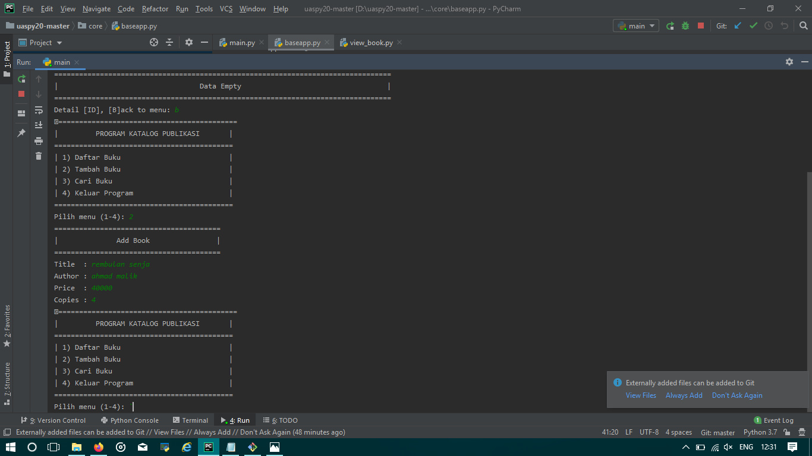
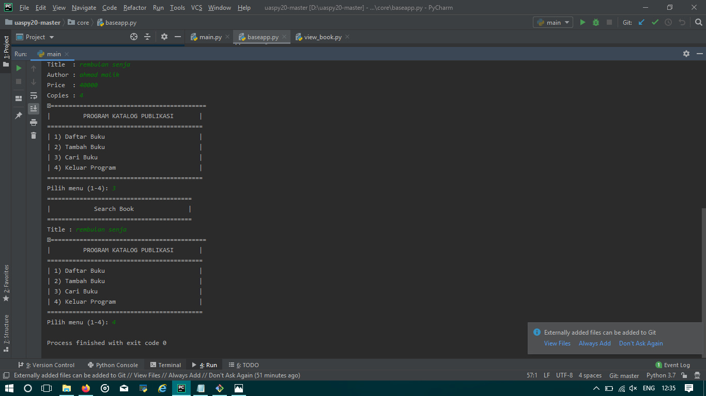

#
Project UAS Bahasa Pemrograman
          :
      author<nama penulis>        :
      prices<harga buku>          :
      copies<banyak buku tersedia>:
  3 = untuk cari buku
  4 = keluar

  ketikan "b" untuk back/kembali ke menu utama

